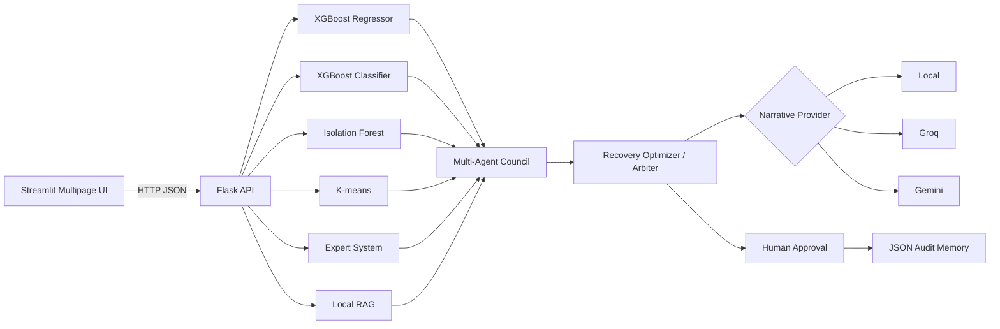

# FulfillTwin AI

**Human–Robot Workforce Digital Twin and Incident Commander**

FulfillTwin AI is a production-oriented portfolio capstone that simulates fulfillment-center disruptions, forecasts their impact, retrieves internal operating guidance, convenes a multi-agent specialist council, compares recovery plans, and preserves every decision in auditable JSON memory.

## Why this is not just another chatbot

The LLM is an optional narrative and coordination layer. The measurable operational intelligence comes from traditional ML, deterministic rules, retrieval, and transparent optimization:

| Capability | Implementation |
|---|---|
| Future backlog | XGBoost regressor |
| SLA-breach probability | XGBoost classifier |
| Out-of-distribution operating state | Isolation Forest |
| Operating-regime discovery | K-means clustering |
| Safety and operating constraints | Internal expert system |
| Policy evidence | Local TF-IDF RAG over Markdown playbooks |
| Recovery strategy | Transparent candidate-plan cost optimizer |
| Narrative providers | Local expert system, Groq, or Gemini |
| Durable memory | Atomic, thread-safe JSON decision store |

The bundled models train on synthetic data on first startup. For production use, replace the synthetic generator with site-specific historical events and retrain.

## Multi-agent council

1. Demand Forecast Agent
2. Workforce Agent
3. Equipment Recovery Agent
4. Dock Flow Agent
5. Energy Agent
6. Safety & Governance Agent
7. Finance Agent
8. Deterministic arbiter/optimizer

## Pages

- **Control Tower** — simulated event stream and recent decisions
- **Scenario Lab** — disruption controls, model execution, plan comparison
- **Agent Council** — specialist reports, rules, RAG evidence, approval status
- **Knowledge Center** — searchable internal operating playbooks
- **Model Ops** — metrics, model card, retraining, JSON memory

## Architecture



## Local setup

```bash
python -m venv .venv
# Windows: .venv\Scripts\activate
# macOS/Linux: source .venv/bin/activate
pip install -r requirements.txt
copy .env.example .env   # Windows
# cp .env.example .env   # macOS/Linux
./start.sh
```

On Windows PowerShell, run the services separately:

```powershell
$env:API_PORT="5000"
python run_api.py
```

Then in a second terminal:

```powershell
$env:FULFILLTWIN_API_URL="http://127.0.0.1:5000"
streamlit run streamlit_app.py
```

Open `http://localhost:8501`.

## LLM configuration

Local mode needs no key. To enable provider-backed executive briefs, add one or both keys to `.env` or your deployment variables:

```dotenv
GROQ_API_KEY=...
GEMINI_API_KEY=...
```

Provider failures automatically fall back to the deterministic local brief. The selectable model lists are environment variables so model availability can be updated without modifying code.

## Railway deployment

1. Push this directory to GitHub.
2. Create one Railway service from the repository.
3. Add `GROQ_API_KEY` and/or `GEMINI_API_KEY` if desired.
4. Railway uses `Dockerfile` and `start.sh`: Flask runs internally on port 5000 and Streamlit uses Railway's public `PORT`.
5. Keep `FULFILLTWIN_API_URL=http://127.0.0.1:5000`.

## Tests

```bash
pytest -q
```

## Governance

- AI recommendations are advisory.
- Overtime, major labor reassignment, or high-risk recovery requires human approval.
- Do not use the system for individual worker scoring or discipline.
- Synthetic-model performance is demonstration evidence, not production validation.
"# FulfillTwin_AI" 
